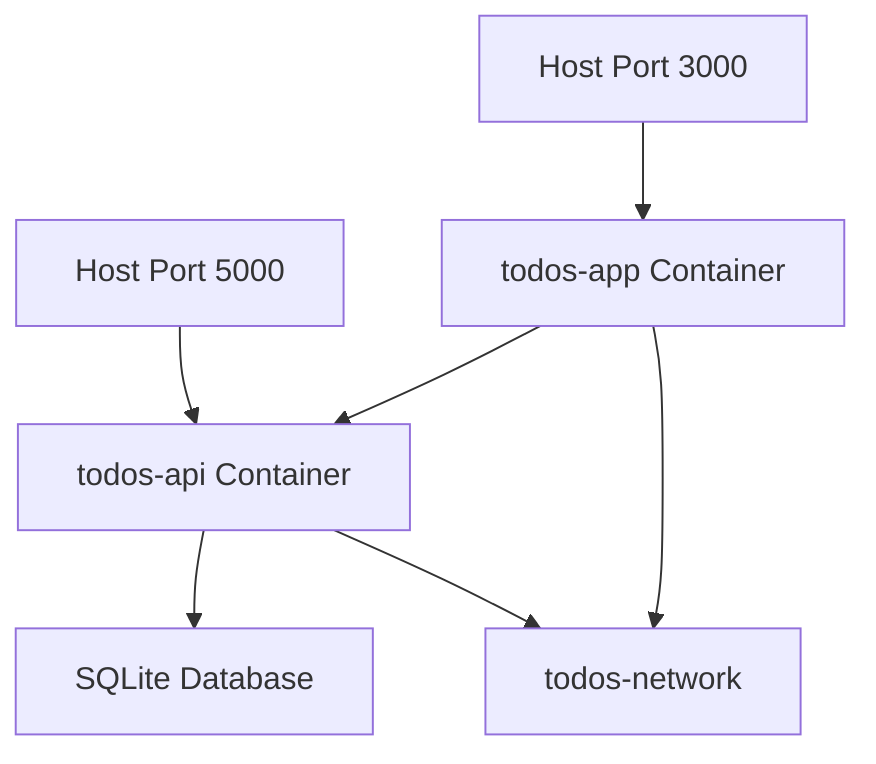

# Deployment Guide - Todos Application

Complete deployment guide for the full-stack Todos application with Docker orchestration.

## 🚀 Quick Deployment

### Prerequisites Checklist
- [ ] Docker Engine installed and running
- [ ] Docker Compose v2.0+ available
- [ ] Ports 3000 and 5000 available on host
- [ ] Minimum 2GB RAM available
- [ ] Git for source code management

### One-Command Deployment
```bash
# Clone and deploy (if from Git)
git clone <your-repo-url>
cd Todos/Todos.Solution
docker compose up -d --build

# Or from existing code
cd /path/to/Todos/Todos.Solution  
docker compose up -d --build
```

**Access URLs after deployment:**
- 🌐 **Frontend**: http://localhost:3000
- 🔧 **API**: http://localhost:5000/graphql  
- 💚 **Health Check**: http://localhost:5000/health

## 📋 Pre-Deployment Verification

### System Requirements
```bash
# Verify Docker installation
docker --version          # Should be 20.0+
docker compose version     # Should be 2.0+

# Check available ports
netstat -an | findstr ":3000"  # Should return nothing
netstat -an | findstr ":5000"  # Should return nothing

# Verify system resources
docker system info | findstr "Total Memory"
```

### Project Structure Verification
```bash
# Ensure correct structure
Todos/
├── todos.app/              ✅ React frontend
│   ├── package.json
│   ├── Dockerfile
│   └── src/
└── Todos.Solution/         ✅ .NET backend  
    ├── docker-compose.yml  ✅ Orchestration file
    ├── Dockerfile
    └── Todos.Api/
```

## 🔧 Deployment Process

### Step 1: Environment Preparation
```bash
# Navigate to deployment directory
cd Todos/Todos.Solution

# Verify docker-compose configuration
docker compose config

# Check if previous containers exist
docker ps -a --filter "name=todos-"
```

### Step 2: Build Process
```bash
# Clean previous builds (optional)
docker compose down
docker system prune -f

# Build with no cache (if needed)
docker compose build --no-cache

# Or build and start together
docker compose up -d --build
```

### Step 3: Verify Deployment
```bash
# Check container status
docker ps --filter "label=com.todos.group=todos-app"

# Check logs
docker compose logs todos-api
docker compose logs todos-app

# Test services
curl http://localhost:5000/health
curl -I http://localhost:3000
```

## 🏗️ Container Architecture

### Service Dependencies


### Container Specifications

| Service | Image Size | CPU Limit | Memory Limit | Health Check |
|---------|------------|-----------|--------------|--------------|
| todos-api | ~200MB | 0.5 CPU | 512MB | ✅ /health endpoint |
| todos-app | ~50MB | 0.2 CPU | 128MB | ✅ HTTP response |

### Network Configuration
```yaml
networks:
  todos-network:
    driver: bridge
    name: todos-network
    labels:
      - "com.todos.network=main"
```

## 🔍 Troubleshooting Common Issues

### Issue 1: Port Already in Use
```bash
# Check what's using the ports
netstat -ano | findstr ":3000"
netstat -ano | findstr ":5000"

# Kill processes or change ports in docker-compose.yml
# Example: Change port mapping
ports:
  - "3001:80"    # Instead of 3000:80
  - "5001:8080"  # Instead of 5000:8080
```

### Issue 2: API Health Check Failing
```bash
# Check API logs
docker logs todos-api

# Common causes and solutions:
# 1. Database connection issues
docker exec todos-api ls -la /app/Todos.db

# 2. CORS configuration
docker exec todos-api cat /app/appsettings.Production.json

# 3. Port binding issues
docker exec todos-api netstat -tulpn | grep :8080
```

### Issue 3: Frontend Cannot Connect to API
```bash
# Check network connectivity
docker network inspect todos-network

# Verify environment variables
docker exec todos-app printenv | grep REACT_APP

# Test internal connectivity
docker exec todos-app nslookup todos-api
docker exec todos-app wget -q -O- http://todos-api:8080/health
```

### Issue 4: Build Failures

**Frontend Build Issues:**
```bash
# Check Node.js version in container
docker run --rm node:18-alpine node --version

# Verify package.json
docker run --rm -v ${PWD}/todos.app:/app -w /app node:18-alpine npm install

# Check for missing dependencies
docker logs <container_id> | grep "Module not found"
```

**Backend Build Issues:**
```bash
# Check .NET SDK version
docker run --rm mcr.microsoft.com/dotnet/sdk:9.0 dotnet --version

# Verify project dependencies
docker run --rm -v ${PWD}/Todos.Solution:/src -w /src mcr.microsoft.com/dotnet/sdk:9.0 dotnet restore

# Check compilation errors
docker logs <container_id> | grep "error CS"
```

## 📊 Monitoring & Maintenance

### Health Monitoring Script
```bash
#!/bin/bash
# health-check.sh

echo "=== Todos Application Health Check ==="
echo "Timestamp: $(date)"
echo

# Check container status
echo "Container Status:"
docker ps --filter "label=com.todos.group=todos-app" --format "table {{.Names}}\t{{.Status}}\t{{.Ports}}"
echo

# Check API health
echo "API Health:"
if curl -f -s http://localhost:5000/health > /dev/null; then
    echo "✅ API is healthy"
    curl -s http://localhost:5000/health | jq '.'
else
    echo "❌ API health check failed"
fi
echo

# Check frontend accessibility
echo "Frontend Status:"
if curl -f -s -I http://localhost:3000 > /dev/null; then
    echo "✅ Frontend is accessible"
else
    echo "❌ Frontend is not accessible"
fi
echo

# Check disk usage
echo "Database Size:"
docker exec todos-api ls -lah /app/Todos.db 2>/dev/null || echo "Database file not accessible"
echo

# Check logs for errors
echo "Recent Errors:"
docker compose logs --tail=10 | grep -i error || echo "No recent errors found"
```

### Log Management
```bash
# View real-time logs
docker compose logs -f

# View specific service logs
docker compose logs -f todos-api
docker compose logs -f todos-app

# Export logs for analysis
docker compose logs > deployment-logs-$(date +%Y%m%d).txt

# Rotate logs (prevent disk space issues)
docker compose logs --tail=1000 todos-api > api-logs.txt
docker compose logs --tail=1000 todos-app > app-logs.txt
```

### Database Backup
```bash
# Backup SQLite database
docker exec todos-api cp /app/Todos.db /app/backup-$(date +%Y%m%d).db

# Copy backup to host
docker cp todos-api:/app/backup-$(date +%Y%m%d).db ./backups/

# Restore database (if needed)
docker cp ./backups/backup-20250909.db todos-api:/app/Todos.db
docker restart todos-api
```

## 🔄 Updates & Rollbacks

### Application Updates
```bash
# Pull latest changes (if from Git)
git pull origin main

# Rebuild and deploy
docker compose up -d --build

# Zero-downtime deployment (advanced)
docker compose up -d --scale todos-app=2  # Scale up
# Test new version
docker compose up -d --scale todos-app=1  # Scale down old
```

### Rollback Process
```bash
# Quick rollback to previous image
docker tag todos-app:current todos-app:backup
docker tag todos-app:previous todos-app:current
docker compose up -d

# Or rebuild from previous code version
git checkout <previous-commit>
docker compose up -d --build
```

## 🌐 Production Considerations

### Reverse Proxy Setup (Optional)
```nginx
# nginx.conf for production reverse proxy
server {
    listen 80;
    server_name yourdomain.com;
    
    location / {
        proxy_pass http://localhost:3000;
        proxy_set_header Host $host;
        proxy_set_header X-Real-IP $remote_addr;
    }
    
    location /graphql {
        proxy_pass http://localhost:5000;
        proxy_set_header Host $host;
        proxy_set_header X-Real-IP $remote_addr;
    }
}
```

### SSL/TLS Configuration
```bash
# Using Let's Encrypt with Certbot
certbot --nginx -d yourdomain.com

# Update docker-compose.yml for HTTPS
environment:
  - ASPNETCORE_URLS=https://+:8443;http://+:8080
  - ASPNETCORE_HTTPS_PORT=8443
```

### Environment Variables for Production
```bash
# .env file for production
ASPNETCORE_ENVIRONMENT=Production
DATABASE_CONNECTION_STRING=Data Source=/data/todos-production.db
CORS_ALLOWED_ORIGINS=https://yourdomain.com
LOG_LEVEL=Information
```

### Security Hardening
```dockerfile
# Run containers as non-root user
FROM nginx:alpine
RUN addgroup -g 1001 -S appgroup && adduser -u 1001 -S appuser -G appgroup
USER appuser
```

## 📈 Scaling Considerations

### Horizontal Scaling
```yaml
# docker-compose.yml for scaling
services:
  todos-app:
    # ... existing configuration
    deploy:
      replicas: 3
      resources:
        limits:
          cpus: '0.5'
          memory: 512M
```

### Load Balancer Configuration
```yaml
# docker-compose.yml with load balancer
services:
  nginx-lb:
    image: nginx:alpine
    ports:
      - "80:80"
    volumes:
      - ./nginx-lb.conf:/etc/nginx/nginx.conf
    depends_on:
      - todos-app
```

---

## 🎯 Deployment Checklist

### Pre-Deployment
- [ ] All ports available
- [ ] Docker daemon running
- [ ] Project structure verified
- [ ] Environment variables configured

### During Deployment  
- [ ] Build completed successfully
- [ ] Containers started without errors
- [ ] Health checks passing
- [ ] Network connectivity verified

### Post-Deployment
- [ ] Frontend accessible at http://localhost:3000
- [ ] API responding at http://localhost:5000/graphql
- [ ] Health endpoint returning 200 OK
- [ ] Database operations working
- [ ] Logs showing no errors

### Production Readiness
- [ ] SSL certificates configured
- [ ] Reverse proxy setup
- [ ] Monitoring in place
- [ ] Backup strategy implemented
- [ ] Update/rollback procedures tested

**🎉 Deployment Complete!** Your Todos application should now be running successfully.
